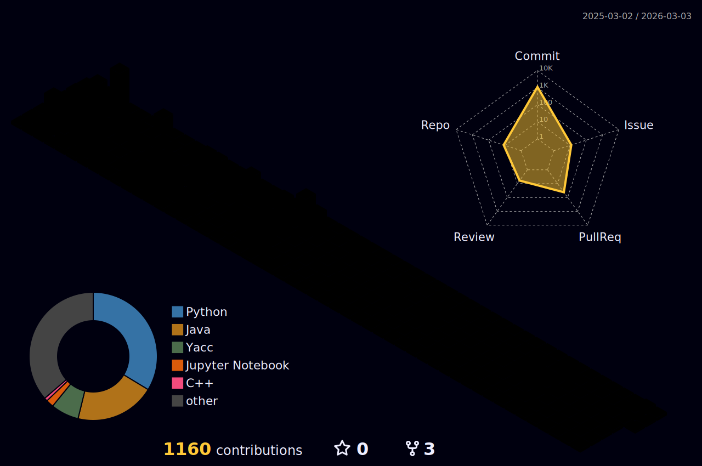

 

<h2 align="center">
  
  <a href="https://git.io/typing-svg">
    &emsp;&emsp;&emsp;&emsp;&emsp;&emsp;&emsp;&emsp;&emsp;&emsp;&emsp;&emsp;
  </a>
</h2>

 
 

**Name** : Yoon 

**Univ.** : Sookmyung Women's University, Department of Computer Science(''25)

**email** : yoonbusinesscontact@gmail.com

**Links** :  

 
 
 
 
 
 

<h2 align="center">
  
  <a href="https://git.io/typing-svg">
&emsp;&emsp;&emsp;&emsp;&emsp;&emsp;&emsp;&emsp;&emsp;&emsp;&emsp;&emsp;&emsp;&emsp;&emsp;
  </a>
</h2>
 

**Languages**

    

**Tools**

     
   
  

**Design**

   

**Office**

    

<!-- badges -->

<!-- links -->

<!--
**Y00NSJ/Y00NSJ** is a ✨ _special_ ✨ repository because its `README.md` (this file) appears on your GitHub profile.

Here are some ideas to get you started:

- 🔭 I’m currently working on ...
- 🌱 I’m currently learning ...
- 👯 I’m looking to collaborate on ...
- 🤔 I’m looking for help with ...
- 💬 Ask me about ...
- 📫 How to reach me: ...
- 😄 Pronouns: ...
- ⚡ Fun fact: ...
-->
