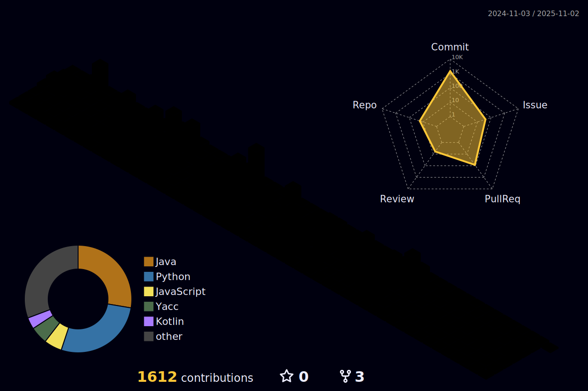

 

<h2 align="center">
  
  <a href="https://git.io/typing-svg">
    &emsp;&emsp;&emsp;&emsp;&emsp;&emsp;&emsp;&emsp;&emsp;&emsp;&emsp;&emsp;
  </a>
</h2>

 
 

**Name** : Yoon SeoJin

**Education** : Sookmyung Women's University, Department of Computer Science('25)
>Originally studied *English Language and Literature* since 2019 before transferring to CS in 2024.

**Outlinks** :  
 
 
 
 
 
 

|projects|explanation|period|role|
|----|----|----|----|
|[Let's IT](https://github.com/LetsIT-BE)|미취업 개발자를 위한 프로젝트 팀원 매칭 및 AI 포트폴리오 생성 플랫폼|`5 months`|BE 개발, AI 엔지니어링, 기획, PM|
|[이음](https://github.com/Y00NSJ/AIF24-2)|GPT 기반 신조어/한자어/전문용어 문장 번역 크롬 확장 프로그램|`1 month`|Full Stack 개발, AI 엔지니어링, 기획|
|[KubeLabX](https://github.com/KubeLabX)|웹 원격 터미널을 통한 리눅스 서버 실습 환경 제공 목적의 k8s 기반 노드 및 웹 터미널 제공 플랫폼|`2 months`|BE 개발, 서버 인프라 관리, 기획|
|[in/space](https://github.com/2024-2-SOLUX-in-space/inspace-backend)|공감각적 레퍼런스 2차원 스크래핑 플랫폼|`1 month`|BE 개발, 서버 인프라 관리|
|[KAILink](https://github.com/jmnew03/KAILink)|몰입캠프_카이스트 신입생을 위한 교내 건물 정보 및 AI 챗봇 App|`1 week`|Android FE 개발, AI 엔지니어링|
|[Mandy](https://github.com/Y00NSJ/Mandy_FE_expo)|몰입캠프_GPT 활용 만다라트 계획표 작성 App|`1 week`|Hybrid App 개발, AI 엔지니어링, 기획|
|꿍꼬또 ([F](https://github.com/Y00NSJ/kkd-FE "레포지토리 바로가기")/[B](https://github.com/Y00NSJ/kkd-BE))|몰입캠프_영상 생성 AI를 통한 꿈 기록 영상화 웹서비스|`1 week`|Full Stack 개발, AI 엔지니어링, 공동 기획|
|[MadCamp Slack](https://github.com/KangGunn/Madcamp_Week4)|몰입캠프_캠프슬랙 워크스페이스를 위한 슬랙봇 모음|`1 week`|Slack Bot 개발, 공동 기획|
|[눈송이 메이커](https://github.com/SnowFlakeMaker)|숙명여대 신입생 대상 게이미피케이션을 통한 학교 생활 체험 및 적응 서비스 |`3 months`|BE 개발, 서버 인프라 관리, 기획|

  
|studies|period|type|
|----|----|----|
|[자바 교재 실습문제 풀이](https://github.com/Y00NSJ/2023-2.Java)|24.01 ~ 24.02|개인|
|OS 공룡책 완독|24.07 ~ 24.08|그룹|
|[컴퓨터 비전과 딥러닝 완독](https://github.com/Y00NSJ/CV-DL)|25.03 ~ |그룹|
|[수학으로 풀어보는 강화학습 원리와 알고리즘 완독](https://github.com/Y00NSJ/RL)|25.04 ~ 25.05|그룹|
|[혼자 공부하는 머신러닝+딥러닝 완독](https://github.com/Y00NSJ/MLDL_intro)|25.05 ~ 25.06|개인|
|Algebra, Calculus, Linear Algebra|25.04 ~ | 개인|

   

<h2 align="center">
  
  <a href="https://git.io/typing-svg">
&emsp;&emsp;&emsp;&emsp;&emsp;&emsp;&emsp;&emsp;&emsp;&emsp;&emsp;&emsp;&emsp;&emsp;&emsp;
  </a>
</h2>
 

**Languages**

       

**Frameworks**

     

**DBMS**

     

**Cloud / Container**

     

**OS**

     

**IDEs / Editors**

       

**Tools**

    
       

 
 
 
<h2></h2>

<!-- badges -->

<!-- links -->

<!--
**Y00NSJ/Y00NSJ** is a ✨ _special_ ✨ repository because its `README.md` (this file) appears on your GitHub profile.

Here are some ideas to get you started:

- 🔭 I’m currently working on ...
- 🌱 I’m currently learning ...
- 👯 I’m looking to collaborate on ...
- 🤔 I’m looking for help with ...
- 💬 Ask me about ...
- 📫 How to reach me: ...
- 😄 Pronouns: ...
- ⚡ Fun fact: ...
-->
